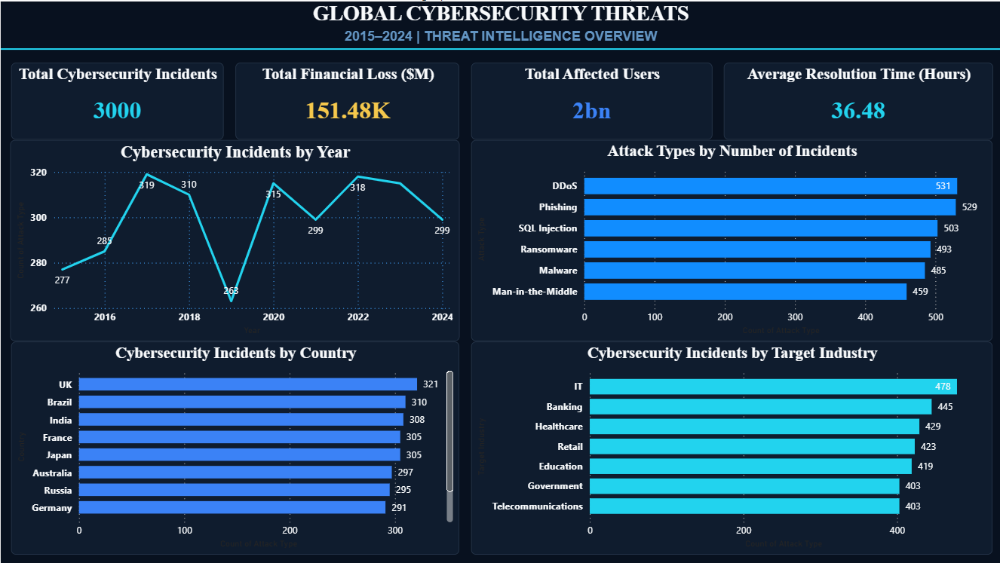
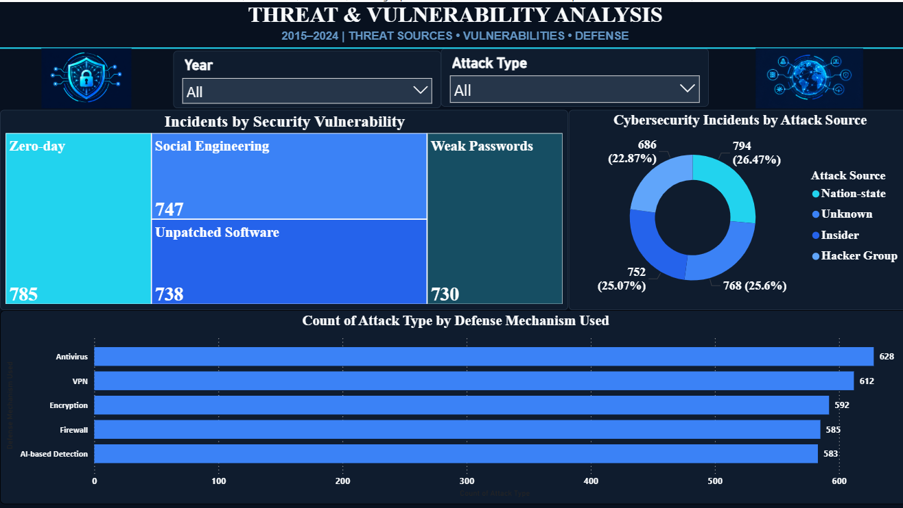
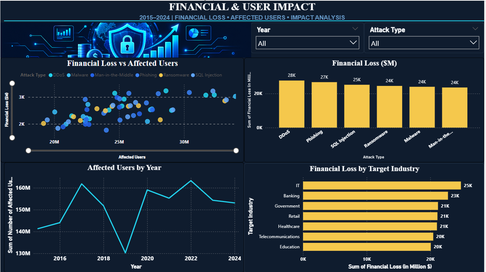
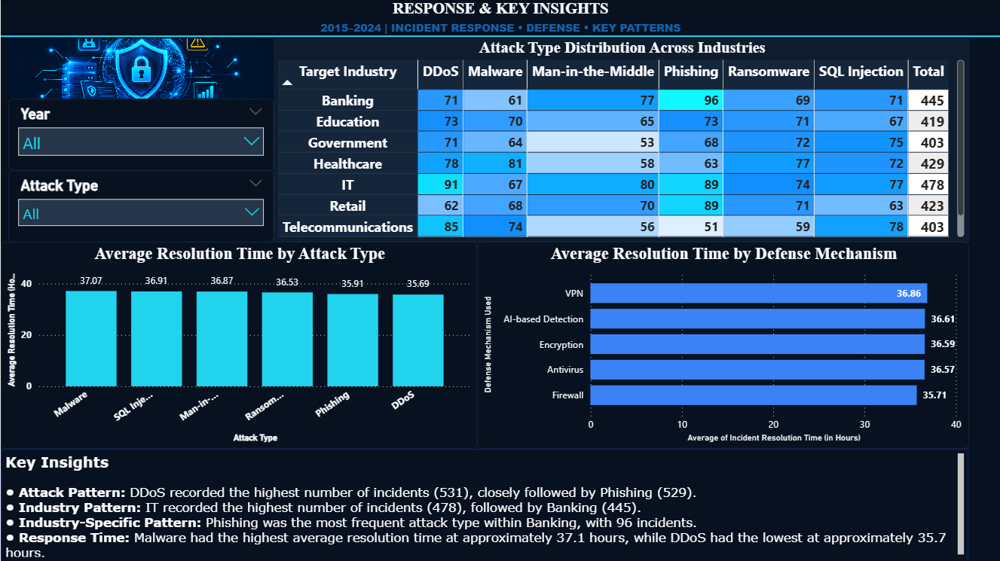

# Global-Cybersecurity-Threats-Analysis
Power BI dashboard analyzing global cybersecurity threats from 2015–2024.

## Page 1 – Cybersecurity Overview

### Overview

The Cybersecurity Overview page provides a high-level summary of the cybersecurity incidents recorded in the dataset from 2015 to 2024. The purpose of this page is to give the viewer an immediate understanding of the overall scale of incidents before moving into more detailed threat, impact, and response analysis.

### Visualizations

- **Total Cybersecurity Incidents:** Shows the total number of cybersecurity incident records in the dataset.

- **Total Financial Loss:** Displays the combined financial loss associated with the recorded cybersecurity incidents.

- **Total Affected Users:** Shows the total number of users affected across all recorded incidents.

- **Average Resolution Time:** Represents the average number of hours required to resolve cybersecurity incidents.

- **Cybersecurity Incidents by Year:** A line chart used to examine how the number of recorded cybersecurity incidents changes from 2015 to 2024.

- **Attack Types by Number of Incidents:** A horizontal bar chart comparing the frequency of different cyberattack types.

- **Cybersecurity Incidents by Target Industry:** Compares the number of incidents recorded across different industries.

- **Cybersecurity Incidents by Country:** Shows the distribution of recorded cybersecurity incidents across countries.

### Key Observations

- DDoS recorded the highest number of incidents in the dataset with 531 incidents, closely followed by Phishing with 529.
- IT recorded the highest number of incidents among the target industries with 478 incidents.
- The yearly trend visualization helps identify changes in cybersecurity incident frequency between 2015 and 2024.
- The page establishes the overall cybersecurity landscape before the dashboard moves into detailed threat and vulnerability analysis.

- ## Page 2 – Threat & Vulnerability Analysis

### Overview

The Threat & Vulnerability Analysis page provides a deeper analysis of the characteristics of cybersecurity incidents. After presenting the overall cybersecurity landscape on Page 1, this page focuses on security vulnerabilities, attack sources, and the defense mechanisms associated with the recorded incidents.

The page also includes Year and Attack Type slicers, allowing users to interactively filter the analysis and examine specific periods or attack categories.

### Visualizations

- **Incidents by Security Vulnerability:** A treemap comparing cybersecurity incidents across different vulnerability types. The size of each section represents the number of incidents associated with that vulnerability. A treemap was selected to provide a compact visual comparison of the relative size of multiple vulnerability categories.

- **Cybersecurity Incidents by Attack Source:** A donut chart showing how the total number of incidents is distributed across different attack sources such as Nation-state, Unknown, Insider, and Hacker Group. The visualization helps compare each source's proportion of the total recorded incidents.

- **Incidents by Defense Mechanism Used:** A horizontal bar chart comparing the number of incident records associated with different defense mechanisms. The horizontal layout makes the defense categories easy to compare and read.

- **Year Slicer:** Allows the dashboard to be filtered according to a selected year.

- **Attack Type Slicer:** Allows users to focus the analysis on a particular type of cyberattack.

### Key Observations

- Zero-day vulnerabilities recorded the highest number of incidents with 785, followed by Social Engineering with 747.
- Unpatched Software and Weak Passwords also accounted for a substantial number of recorded incidents, with 738 and 730 respectively.
- Nation-state represented the largest attack-source category in the dataset, accounting for approximately 26.5% of recorded incidents.
- Antivirus was the most frequently recorded defense mechanism with 628 incidents, followed by VPN with 612.
- The defense mechanism visualization represents the mechanisms recorded alongside incidents and should not be interpreted as a direct measure of their effectiveness.

### Advanced Visualization

The Security Vulnerability treemap was included as an advanced visualization. Unlike a standard bar chart, the treemap uses the size of each rectangular area to represent the number of incidents associated with each vulnerability type. This makes it possible to quickly identify the most prominent vulnerability categories while using dashboard space efficiently.

## Page 3 – Financial & User Impact

### Overview

The Financial & User Impact page focuses on understanding the consequences of cybersecurity incidents. While the previous pages examine the overall threat landscape and vulnerability patterns, this page analyzes the financial impact and the number of users affected by cybersecurity incidents.

The page also includes Year and Attack Type slicers, allowing users to interactively filter the visualizations and analyze the impact for specific periods or attack categories.

### Visualizations

- **Financial Loss vs Affected Users:** A scatter plot used to examine the relationship between two numerical variables: Number of Affected Users and Financial Loss. Attack Type is used to distinguish the different attack categories. The visualization helps identify patterns between user impact and financial impact without assuming a causal relationship.

- **Financial Loss by Attack Type:** A clustered column chart comparing the total financial loss associated with each attack type. Attack Type is used as the category and Sum of Financial Loss is used as the numerical measure.

- **Affected Users by Year:** A line chart showing how the total number of affected users changes from 2015 to 2024. A line chart was selected because Year is a time-based variable and the visualization makes changes and trends over time easier to identify.

- **Financial Loss by Target Industry:** A horizontal bar chart comparing the total financial loss recorded across different target industries. The horizontal layout improves the readability of longer industry names and allows the industries to be compared easily.

- **Year Slicer:** Allows the impact analysis to be filtered according to a selected year.

- **Attack Type Slicer:** Allows the user to analyze the financial and user impact associated with a specific cyberattack category.

### Key Observations

- DDoS recorded the highest total financial loss in the dataset at approximately 28K million dollars, followed by Phishing at approximately 27K million dollars.
- IT recorded the highest total financial loss among the target industries at approximately 25K million dollars.
- Banking recorded the second-highest total financial loss at approximately 23K million dollars.
- The Affected Users by Year visualization shows how user impact varies across the 2015–2024 period.
- The scatter plot allows the relationship between the number of affected users and financial loss to be explored across different attack types.

## Page 4 – Response & Key Insights

### Overview

The Response & Key Insights page is the final stage of the cybersecurity analysis. It focuses on incident resolution time, the distribution of attack types across industries, and the major patterns identified throughout the dashboard.

This page brings together response-related metrics and key findings to provide a concise conclusion to the analysis.

### Visualizations

- **Attack Type Distribution Across Industries:** A matrix visualization comparing Target Industry and Attack Type. Target Industry is placed in the rows, Attack Type in the columns, and Count of Attack Type is used as the value. This allows multiple attack types and industries to be compared simultaneously.

- **Matrix Heatmap:** Conditional background formatting is applied to the matrix to create a heatmap effect. Higher incident counts are highlighted more strongly, making important industry and attack-type combinations easier to identify without reading every individual value.

- **Average Resolution Time by Attack Type:** A clustered column chart comparing the average incident resolution time across different cyberattack categories. Average is used instead of Sum because it provides a more meaningful comparison of the typical resolution time for each attack type.

- **Average Resolution Time by Defense Mechanism:** A horizontal bar chart comparing the average incident resolution time associated with different defense mechanisms. The visualization represents associations in the recorded data and is not intended to measure the effectiveness of individual defense mechanisms.

- **Year Slicer:** Allows the response analysis to be filtered for a selected year.

- **Attack Type Slicer:** Allows the user to focus the analysis on a specific attack category.

### Key Insights

- **Attack Pattern:** DDoS recorded the highest number of incidents with 531, closely followed by Phishing with 529.
- **Industry Pattern:** IT recorded the highest number of incidents with 478, followed by Banking with 445.
- **Industry-Specific Pattern:** Phishing was the most frequent attack type within Banking, with 96 recorded incidents.
- **Response Time:** Malware had the highest average resolution time at approximately 37.1 hours, while DDoS had the lowest at approximately 35.7 hours.
- The differences in average resolution time across defense mechanisms are relatively small and should not be interpreted as evidence that one defense mechanism is more effective than another.

### Advanced Visualization

The Industry × Attack Type matrix uses conditional formatting to create a heatmap-style visualization. The combination of a cross-tabular matrix and color intensity makes it possible to identify concentrations of cybersecurity incidents across industries and attack types quickly.

For example, Banking recorded 96 Phishing incidents, while IT recorded 91 DDoS incidents. These higher values become more visually prominent through the conditional formatting.

### Dashboard Conclusion

The four-page dashboard follows a structured analytical story:

**Overview → Threats & Vulnerabilities → Financial & User Impact → Response & Key Insights**

The analysis begins with the overall cybersecurity landscape, moves into the sources and vulnerabilities associated with incidents, evaluates their financial and user impact, and concludes by examining incident response and summarizing the major patterns identified in the dataset.
### Visualization Design

Amber was used for the financial-loss visualizations to visually distinguish monetary impact from the blue and cyan colors used for general cybersecurity metrics. This maintains a consistent cybersecurity theme while making the financial impact easier to identify.
